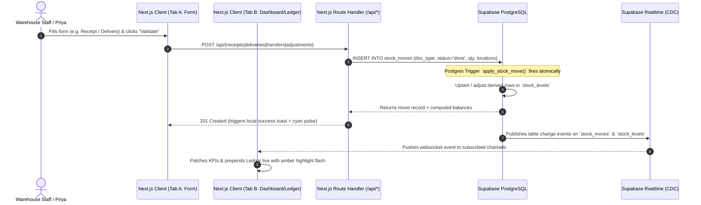

# StockSense — Implementation Plan & Readiness Blueprint

> **Hackathon Target:** ODOO x GCET Hackathon  
> **Value Proposition:** Real-time stock ledger with predictive alerts replacing manual registers, Excel, and WhatsApp workflows for SMB warehouses.  
> **Key Differentiator:** Immutable ledger-first architecture + Supabase Realtime CDC channels syncing multiple screens instantly with zero polling.

---

## 1. System Architecture & Information Flow



### Key Architectural Tenets
1. **Server-Rendered Initial Paint + Client-Side Realtime Patching:** Pages fetch initial state via Next.js Server Components (no loading spinners on first load). Interactive components hydrate and subscribe to Supabase Realtime CDC channels to patch state in-place.
2. **Mutations via API Route Handlers Only:** Clients never write directly to Postgres. All stock operations go through `/api/*` handlers with Zod schema validation to ensure auditability, transaction consistency, and error handling.
3. **Dual Highlight Distinction (The Hackathon "Aha!"):**
   - **Cyan `#22D3EE` pulse:** Triggers on the active user's screen when their local action succeeds.
   - **Amber `#FBBF24` highlight:** Triggers on remote/second screens when a Realtime CDC payload arrives from another client. This visually proves to judges that updates are truly event-driven across devices, not optimistic local UI hacks.

---

## 2. Database Schema, Triggers & Seed Engineering

### 2.1 Complete DDL (`supabase/schema.sql`)

```sql
-- 1. Warehouses & Locations
create table if not exists warehouses (
  id uuid primary key default gen_random_uuid(),
  name text not null,
  created_at timestamptz default now()
);

create table if not exists locations (
  id uuid primary key default gen_random_uuid(),
  warehouse_id uuid references warehouses(id) on delete cascade not null,
  name text not null
);

-- 2. Products
create table if not exists products (
  id uuid primary key default gen_random_uuid(),
  sku text unique not null,
  name text not null,
  category text,
  unit text default 'unit',
  low_stock_threshold int default 10,
  created_at timestamptz default now()
);

-- 3. Derived Per-Location Stock Levels
create table if not exists stock_levels (
  product_id uuid references products(id) on delete cascade not null,
  location_id uuid references locations(id) on delete cascade not null,
  quantity numeric not null default 0,
  primary key (product_id, location_id)
);

-- 4. Immutable Stock Moves Ledger
create table if not exists stock_moves (
  id uuid primary key default gen_random_uuid(),
  doc_type text not null check (doc_type in ('receipt', 'delivery', 'transfer', 'adjustment')),
  status text not null default 'done' check (status in ('draft', 'waiting', 'ready', 'done', 'canceled')),
  product_id uuid references products(id) on delete cascade not null,
  from_location_id uuid references locations(id),   -- null for receipts
  to_location_id uuid references locations(id),     -- null for deliveries
  quantity numeric not null,
  reference text,                                    -- PO#, SO#, or reason code
  created_at timestamptz default now()
);

-- 5. Trigger Function for Realtime Atomic Stock Adjustments
create or replace function apply_stock_move() returns trigger as $$
begin
  -- Deduct from source location
  if new.from_location_id is not null then
    insert into stock_levels (product_id, location_id, quantity)
    values (new.product_id, new.from_location_id, -new.quantity)
    on conflict (product_id, location_id)
    do update set quantity = stock_levels.quantity - new.quantity;
  end if;

  -- Add to destination location
  if new.to_location_id is not null then
    insert into stock_levels (product_id, location_id, quantity)
    values (new.product_id, new.to_location_id, new.quantity)
    on conflict (product_id, location_id)
    do update set quantity = stock_levels.quantity + new.quantity;
  end if;

  return new;
end;
$$ language plpgsql;

drop trigger if exists trg_apply_stock_move on stock_moves;
create trigger trg_apply_stock_move
after insert on stock_moves
for each row when (new.status = 'done')
execute function apply_stock_move();

-- 6. Indexes for High-Velocity Queries
create index if not exists idx_moves_doc_type on stock_moves(doc_type);
create index if not exists idx_moves_status on stock_moves(status);
create index if not exists idx_moves_created on stock_moves(created_at desc);
create index if not exists idx_moves_product on stock_moves(product_id);
create index if not exists idx_levels_product on stock_levels(product_id);

-- 7. Supabase Realtime Publication
alter publication supabase_realtime add table stock_moves;
alter publication supabase_realtime add table stock_levels;
```

### 2.2 Demo-Tuned Seed Script (`supabase/seed.sql`)

Tuned specifically so that the 180s demo script runs predictably:
- **Product A ("Steel Rods", SKU: `RAW-STL-001`):** Currently at 15 units (threshold: 10). Delivering 8 units in step 2 pushes it to 7 units, reliably tripping the Low Stock badge live on screen.
- **Product B ("Hydraulic Pumps", SKU: `PRT-HYD-102`):** Seeded at 80 units in Main Store; ready for internal transfer of 20 units to Production Rack.
- **Product C ("Engine Mounts", SKU: `ENG-MNT-550`):** Seeded at 25 units; ready for physical count adjustment (e.g. 3 damaged).

---

## 3. Backend & API Route Contracts

All route handlers are placed in Next.js App Router `app/api/`:

| Endpoint | Method | Input Payload | Response & Side Effect |
|---|---|---|---|
| `/api/receipts` | `POST` | `{ productId, toLocationId, quantity, reference }` | Inserts `stock_moves` (doc_type='receipt', from=null). Trigger adds quantity to `toLocationId`. Returns move record. |
| `/api/deliveries` | `POST` | `{ productId, fromLocationId, quantity, reference }` | Validates current stock >= requested qty. Inserts `stock_moves` (doc_type='delivery', to=null). Checks if new total <= low_stock_threshold (`lowStockTriggered: boolean`). |
| `/api/transfers` | `POST` | `{ productId, fromLocationId, toLocationId, quantity }` | Checks source balance. Inserts `stock_moves` (doc_type='transfer'). Atomic relocation. |
| `/api/adjustments` | `POST` | `{ productId, locationId, countedQuantity, reason }` | Computes delta = counted - current. Inserts positive receipt-like move or negative delivery-like move with doc_type='adjustment'. |
| `/api/dashboard/kpis` | `GET` | — | Computes `{ totalProducts, lowStockCount, pendingReceipts, pendingDeliveries, scheduledTransfers }`. |

---

## 4. Frontend Component Matrix & Stitch Alignment

The UI matches the 8 screens generated/designed by Stitch, using the unified design system:

| # | Stitch Screen / Route | Components to Build | Key Data & Realtime Hooks |
|---|---|---|---|
| **0** | **Design Tokens & Theme** | `tailwind.config.ts`, `globals.css` | Theme colors (`#0A0A0B`, `#161618`, `#27272A`, cyan `#22D3EE`, green `#34D399`, red `#F87171`), fonts (Inter + JetBrains Mono). |
| **1** | **Dashboard** (`/dashboard`) | `kpi-grid.tsx`, `kpi-card.tsx`, `movement-chart.tsx`, `recent-activity.tsx`, `realtime-indicator.tsx` | `useDashboardKpis`, `useRealtimeChannel('stock_moves')`. Framer Motion spring counters, flashing card borders. |
| **2** | **Products List** (`/products`) | `product-table.tsx`, `product-filter-bar.tsx`, `stock-badge.tsx`, `product-create-dialog.tsx` | Server fetch + `useRealtimeChannel('stock_levels')`. Search by SKU/name, category and warehouse filters. |
| **3** | **Product Detail Sheet** | `product-detail-sheet.tsx`, `location-stock-bar.tsx`, `product-moves-mini.tsx` | Slide-over drawer with horizontal stacked bar of location inventory + last 10 audit moves. |
| **4** | **Receipt Form** (`/receipts/new`) | `receipt-form.tsx`, `validate-button.tsx` | `react-hook-form` + `zod`. Searchable product select, destination location, quantity, supplier reference. |
| **5** | **Delivery Form** (`/deliveries/new`) | `delivery-form.tsx`, `low-stock-warning.tsx`, `validate-button.tsx` | Dynamic calculation: warns if `currentStock - enteredQty <= threshold`. |
| **6** | **Internal Transfer Form** (`/transfers/new`) | `transfer-form.tsx`, `location-connector.tsx` | Connected From → Arrow → To location layout. Validates sufficient stock at source. |
| **7** | **Stock Adjustment Form** (`/adjustments/new`) | `adjustment-form.tsx`, `delta-indicator.tsx` | Displays current recorded stock, user enters physical count, live Δ display (+/- color-coded). |
| **8** | **Move History / Ledger** (`/ledger`) | `ledger-table.tsx`, `ledger-filter-bar.tsx`, `doc-type-badge.tsx` | Dense auditable feed, live prepend on CDC event with highlight flash, filter pills by doc type, warehouse, and date. |

---

## 5. Phased Implementation Roadmap

### Phase 1: Workspace Scaffolding & Setup (Immediate Readiness)
- Initialize Next.js 14 App Router project with TypeScript, Tailwind CSS, PostCSS, and ESLint.
- Install core production dependencies:
  - `@supabase/supabase-js`, `@supabase/ssr`
  - `framer-motion`, `recharts`, `lucide-react`, `sonner`
  - `zod`, `react-hook-form`, `@hookform/resolvers`
- Configure shadcn/ui components: `button`, `card`, `table`, `dialog`, `sheet`, `badge`, `input`, `select`, `label`, `skeleton`, `sonner`.
- Configure design tokens in `tailwind.config.ts` (Linear/Vercel dark theme palette, fonts, shadows, borders).

### Phase 2: Database Layer & Seed Configuration
- Create `supabase/schema.sql` (tables, triggers, publications, indexes).
- Create `supabase/seed.sql` with realistic warehouse data (warehouses, locations, products with low-stock edge thresholds).
- Scaffold Supabase client helpers:
  - `lib/supabase/client.ts` (Browser client with anonymous key for Realtime CDC).
  - `lib/supabase/server.ts` (Server client for Route Handlers and Server Components).
  - `lib/types.ts` (Strict TypeScript interfaces mirroring the database models).

### Phase 3: Route Handlers & Business Logic Layer
- Implement `app/api/receipts/route.ts` (Validate receipt & trigger stock increase).
- Implement `app/api/deliveries/route.ts` (Validate stock availability, execute deduction, detect low-stock breach).
- Implement `app/api/transfers/route.ts` (Validate source quantity, atomic location transfer).
- Implement `app/api/adjustments/route.ts` (Compute discrepancy delta, log adjustment ledger entry).
- Implement `app/api/dashboard/kpis/route.ts` (Compute high-speed aggregated KPIs).

### Phase 4: Shared Layout & Realtime Hook Engine
- Create application layout (`app/layout.tsx`) with dark theme shell, font loader, and Sonner toaster.
- Build persistent navigation components:
  - `components/layout/sidebar.tsx` (Collapsible sidebar matching Stitch specs: Dashboard, Products, Receipts, Deliveries, Transfers, Adjustments, Ledger, Settings, Profile menu).
  - `components/layout/topbar.tsx` (Breadcrumb, live status indicator, quick actions).
- Develop hooks:
  - `hooks/use-realtime-channel.ts` (Subscription wrapper with automatic cleanup).
  - `hooks/use-dashboard-kpis.ts` (Realtime KPI sync with 3-second fallback polling).
  - `hooks/use-stock-ledger.ts` (Realtime prepend hook with amber highlight tag).

### Phase 5: Stitch UI/UX Integration & Screen Implementation
- Ingest Stitch design assets / screens (once the user links the Stitch MCP or pastes generated HTML/styles).
- Implement the 8 key views:
  1. `/dashboard`: 5 KPI cards with animated spring counters + 7-day movement chart + recent activity feed.
  2. `/products`: Scannable product table, SKU search, threshold status badges, click-to-open detail.
  3. Product Detail Sheet: Per-location segmented bar + product-specific ledger history.
  4. `/receipts/new`: Receipt creation form with supplier reference & validate action.
  5. `/deliveries/new`: Delivery order form with live threshold warning banner.
  6. `/transfers/new`: From → To location selector with visual connector.
  7. `/adjustments/new`: Physical inventory adjustment with real-time delta preview.
  8. `/ledger`: Master Move History table with filter pills and live CDC row insertion.

### Phase 6: Polish, Fail-Safe Testing & Demo Rehearsal
- **Dual-Browser Verification:** Test side-by-side browser windows (Window 1: Submit receipt/delivery; Window 2: Dashboard and Ledger updating instantaneously with zero refresh).
- **Fallback Verification:** Verify the 3-second polling fallback automatically activates if network websockets stutter.
- **Seed Reset Command:** Create `npm run db:reset` or quick SQL snippet to restore DB to the exact demo starting state in 2 seconds between judging rounds.

---

## 6. Demo Script Alignment Checklist

| Timeline | Action | Verified System Behavior |
|---|---|---|
| **0:00 - 0:20** | Open Dashboard | Realistic seed data visible, 5 KPIs populated, "Live" pulsing green/cyan indicator active. |
| **0:20 - 0:50** | Validate Receipt | Add 50 "Steel Rods" → Window 2 dashboard KPI counter animates upward with zero manual refresh. |
| **0:50 - 1:20** | Validate Delivery | Deliver 8 "Steel Rods" → Total drops below threshold (7 < 10) → Low Stock KPI card border pulses red live. |
| **1:20 - 1:45** | Internal Transfer | Move 20 units from Main Store → Production Floor → Product Detail sheet updates location breakdown instantly. |
| **1:45 - 2:10** | Stock Adjustment | Physical count discrepancy (-3 units) logged with reason code "Damaged in transit". |
| **2:10 - 2:50** | Move History Ledger | Open Ledger: all 4 actions visible with timestamps, document type badges, and location traces. |
| **2:50 - 3:00** | Closing Vision | Highlight roadmap (barcode scanning, automated reorder rules, multi-warehouse routing). |
