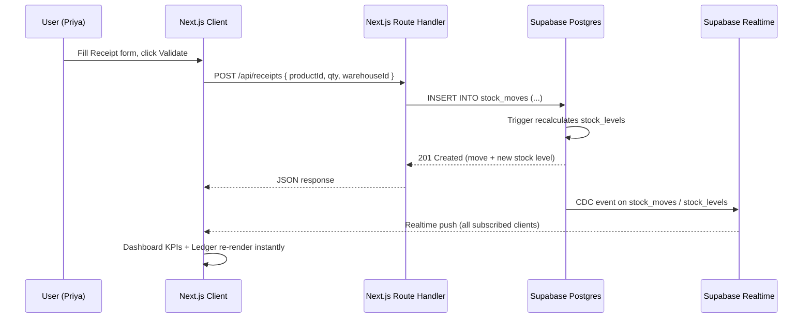

# SYSTEM_DESIGN.md — StockSense

## 1. High-Level System Architecture



**Core principle:** the client never trusts its own optimistic state for the "wow" moment — the dashboard and ledger are *independent subscribers* to the same Postgres change stream, so the demo literally proves the system is event-driven, not polling.

## 2. Data Model (Supabase / PostgreSQL DDL)

```sql
-- Warehouses (seeded, no CRUD UI in P0)
create table warehouses (
  id uuid primary key default gen_random_uuid(),
  name text not null,
  created_at timestamptz default now()
);

-- Locations within a warehouse (e.g. "Main Store", "Production Rack")
create table locations (
  id uuid primary key default gen_random_uuid(),
  warehouse_id uuid references warehouses(id) not null,
  name text not null
);

-- Products
create table products (
  id uuid primary key default gen_random_uuid(),
  sku text unique not null,
  name text not null,
  category text,
  unit text default 'unit',
  low_stock_threshold int default 10,
  created_at timestamptz default now()
);

-- Derived, denormalized per-location stock (kept in sync by trigger)
create table stock_levels (
  product_id uuid references products(id) not null,
  location_id uuid references locations(id) not null,
  quantity numeric not null default 0,
  primary key (product_id, location_id)
);

-- Append-only ledger — the single source of truth
create table stock_moves (
  id uuid primary key default gen_random_uuid(),
  doc_type text not null check (doc_type in ('receipt','delivery','transfer','adjustment')),
  status text not null default 'done' check (status in ('draft','waiting','ready','done','canceled')),
  product_id uuid references products(id) not null,
  from_location_id uuid references locations(id),   -- null for receipts
  to_location_id uuid references locations(id),     -- null for deliveries
  quantity numeric not null,
  reference text,                                    -- supplier / sales order / reason code
  created_at timestamptz default now()
);

-- Trigger: every inserted move updates stock_levels atomically
create or replace function apply_stock_move() returns trigger as $$
begin
  if new.from_location_id is not null then
    insert into stock_levels (product_id, location_id, quantity)
    values (new.product_id, new.from_location_id, -new.quantity)
    on conflict (product_id, location_id)
    do update set quantity = stock_levels.quantity - new.quantity;
  end if;

  if new.to_location_id is not null then
    insert into stock_levels (product_id, location_id, quantity)
    values (new.product_id, new.to_location_id, new.quantity)
    on conflict (product_id, location_id)
    do update set quantity = stock_levels.quantity + new.quantity;
  end if;

  return new;
end;
$$ language plpgsql;

create trigger trg_apply_stock_move
after insert on stock_moves
for each row when (new.status = 'done')
execute function apply_stock_move();

-- Indexes for the dashboard/ledger filters
create index idx_moves_doc_type on stock_moves(doc_type);
create index idx_moves_status on stock_moves(status);
create index idx_moves_created on stock_moves(created_at desc);
create index idx_levels_product on stock_levels(product_id);

-- Enable Realtime
alter publication supabase_realtime add table stock_moves;
alter publication supabase_realtime add table stock_levels;
```

**Mapping to operations:**
- **Receipt** → `to_location_id` set, `from_location_id` null.
- **Delivery** → `from_location_id` set, `to_location_id` null.
- **Transfer** → both set (same product, two locations).
- **Adjustment** → `to_location_id` or `from_location_id` set depending on sign, `reference` holds the reason code.

## 3. Core API Contracts

### `POST /api/receipts`
```json
// Request
{
  "productId": "b3a1...",
  "toLocationId": "loc-main-store",
  "quantity": 50,
  "reference": "Acme Metals - PO#1042"
}
// Response 201
{
  "moveId": "9f2e...",
  "docType": "receipt",
  "newStockLevel": { "locationId": "loc-main-store", "quantity": 150 }
}
```

### `POST /api/deliveries`
```json
// Request
{
  "productId": "b3a1...",
  "fromLocationId": "loc-main-store",
  "quantity": 20,
  "reference": "Sales Order #SO-2291"
}
// Response 201
{
  "moveId": "a71c...",
  "docType": "delivery",
  "newStockLevel": { "locationId": "loc-main-store", "quantity": 130 },
  "lowStockTriggered": true,
  "threshold": 10
}
```

### `POST /api/transfers`
```json
// Request
{
  "productId": "b3a1...",
  "fromLocationId": "loc-main-store",
  "toLocationId": "loc-production-rack",
  "quantity": 20
}
// Response 201
{
  "moveId": "c105...",
  "docType": "transfer",
  "levels": [
    { "locationId": "loc-main-store", "quantity": 110 },
    { "locationId": "loc-production-rack", "quantity": 20 }
  ]
}
```

### `GET /api/dashboard/kpis` (or a Supabase view queried directly from the client)
```json
{
  "totalProducts": 42,
  "lowStockCount": 3,
  "pendingReceipts": 1,
  "pendingDeliveries": 2,
  "scheduledTransfers": 0
}
```

## 4. UI/UX Design Specification

### Layout Wireframe Breakdown

- **Hero (Dashboard top band):** 5 KPI cards in a horizontal grid, each with an animated counter (Framer Motion `useSpring`) and a delta indicator (▲/▼ vs. yesterday, P1). Low Stock card turns red-bordered when count > 0.
- **Primary Action Workspace:** Left sidebar nav (Dashboard, Products, Receipts, Deliveries, Transfers, Adjustments, Ledger, Settings, Profile) — collapsed icon rail on mobile. Main panel is a data table (shadcn `Table`) with a sticky filter bar (doc type / status / warehouse / category as pill-style `Select` dropdowns).
- **Result Visualization:** Right-side or modal detail panel — clicking a product opens a slide-over showing per-location stock as horizontal bar segments, plus a mini ledger of that product's last 10 moves.

### Design System Tokens

| Token | Value |
|---|---|
| Theme | Dark-first (Linear/Vercel aesthetic), light theme optional P1 toggle |
| Background | `#0A0A0B` (near-black) |
| Surface / Card | `#161618` |
| Border | `#27272A` |
| Primary Accent | `#22D3EE` (cyan — "signal" color for live/realtime elements) |
| Success | `#34D399` (stock increase / validated) |
| Danger / Low Stock | `#F87171` |
| Warning | `#FBBF24` (pending/draft status) |
| Text Primary | `#FAFAFA` |
| Text Secondary | `#A1A1AA` |
| Font — UI | `Inter` (via next/font, variable weight) |
| Font — Numeric/KPI | `JetBrains Mono` for stock quantities and SKUs — reinforces "data-forward, precise" feel |
| Radius | `0.75rem` cards, `0.5rem` inputs/buttons |
| Shadow | Subtle `0 0 0 1px border + 0 8px 24px rgba(0,0,0,0.4)` on cards |

### Feedback States & Micro-Animations

- **Skeleton loaders:** shadcn `Skeleton` components matching exact KPI card / table row dimensions on initial load and during realtime refetch — never a blank flash.
- **Validate action:** button shows spinner → on success, row/card pulses once with a cyan glow (`framer-motion` `boxShadow` keyframe) before settling, paired with a `sonner` toast ("Receipt validated — stock +50").
- **Realtime arrival:** any KPI or table row updated via a Realtime event (not a user's own action) gets a brief highlight flash in a *different* color (amber) than the user's own validate action (cyan) — this visually proves to judges that two independent screens are syncing, not just optimistic local state.
- **Low stock trigger:** the KPI card border animates from neutral to red with a soft pulse, and a toast fires: "⚠ Steel Rods below threshold (8/10)."
- **Empty states:** every table/list has a designed empty state (icon + one-line copy + primary CTA), never a bare "No data."
