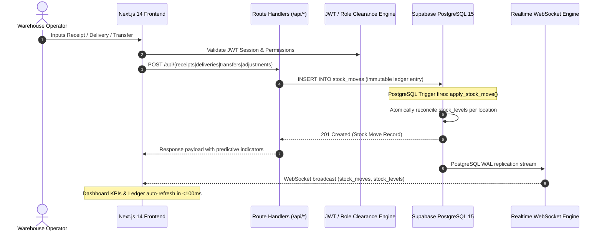

# StockSense — Real-Time Warehouse Stock Ledger & Predictive WMS

<div align="center">


-brightgreen?style=for-the-badge)

**Built for the ODOO x GCET Hackathon**  
*Replacing fragile spreadsheets, paper registers, and WhatsApp dispatch logs with an immutable, sub-second event-driven stock ledger and predictive safety alerts.*

[Explore Live Demo](#-quick-start) • [Architecture](#-system-architecture) • [Demo Credentials](#-operator-credentials) • [QA Test Plan](Docs/QA_TEST_PLAN.md)

</div>

---

## 📌 Executive Summary

### The Real-World Problem
Small and medium-sized warehouse operations often struggle with manual tracking:
- Inventory counts drift from reality within days due to untracked movements.
- Warehouse managers only discover shortages **after** a customer dispatch order fails.
- Physical item locations remain unknown until warehouse staff physically walk the floor.
- Paper receipts, WhatsApp dispatches, and spreadsheet rows lack auditability and transactional integrity.

### The StockSense Solution
**StockSense** delivers an enterprise-grade, ledger-first Warehouse Management System (WMS) inspired by Odoo's operational workflows:
1. **Immutable Double-Entry Ledger:** Every receipt, delivery, transfer, and cycle-count adjustment writes an immutable audit record to `stock_moves`.
2. **Atomic Triggered Balances:** `stock_levels` are never manually mutated by application code. PostgreSQL database triggers recalculate exact per-location inventory atomically upon every movement insert.
3. **Sub-Second CDC Synchronization:** Integrated with Supabase Realtime Change Data Capture (CDC) over WebSockets, pushing live inventory balances, KPI updates, and alert events to all screens without polling or page reloads.
4. **Predictive Dispatch Guards:** The delivery workflow calculates remaining balances *before* validation and triggers proactive visual warnings when dispatches will breach safety stock thresholds.
5. **Operator Authentication & Ingress Portal:** Google Stitch-designed terminal login featuring live telemetry, Merkle proof verification, simulated optical barcode scanning, NFC badge tap, and role-based JWT clearance.

---

## 🚀 Key Features

| Feature | Description | Operational Impact |
| :--- | :--- | :--- |
| **📊 Real-Time Operations Hub** | Live KPI counters (Total SKUs, Low Stock, Pending Receipts, Dispatches, Transfers) with animated feeds. | Eliminates stale end-of-day reports. |
| **📦 Dynamic Product Catalog** | Multi-attribute search, category filters, stock health pills (`Healthy`, `Low Stock`, `Critical`), and product drawer. | Complete visibility into on-hand quantities across storage locations. |
| **📥 Inbound Receipts** | Vendor receipt entry with instant location-specific stock increments and immutable ledger inscription. | Immediate inventory availability upon delivery arrival. |
| **🚚 Outbound Deliveries** | Proactive predictive threshold detection that intercepts stock-outs before physical picking occurs. | Prevents broken delivery promises and backorder cascades. |
| **🔄 Internal Location Transfers**| Conserved inventory transfer between storage zones (e.g., Main Store to Production Rack) with zero net discrepancy. | Full trace of physical stock transit across warehouse bays. |
| **⚖ Physical Cycle Adjustments** | Visual audit preview highlighting surplus (+$\Delta$) or shrinkage (-$\Delta$) before atomic ledger reconciliation. | Fast periodic cycle counting without halting warehouse activity. |
| **📜 Master Audit Ledger** | Permanent ledger stream filterable by document type with CSV export capability and live CDC highlights. | 100% regulatory audit compliance and tamper resistance. |
| **🔐 Stitch Ingress Portal** | Dual-column tactical UI with live UTC precision clock, node status (`Austin WH-01`), Merkle proof, and 1-click test roles. | Secure terminal login with role-based access control. |

---

## 🏗 System Architecture

StockSense follows a unidirectional, reactive event-driven architecture:



### Core Integrity Principles
- **Ledger-First Invariance:** Stock counts are never stored in isolation without a matching ledger movement. Summing an item's move history always reconciles to its active balance.
- **Zero Race Conditions:** Inventory reservation and deductions run inside PostgreSQL transactional boundaries with row-level locks on stock levels.
- **Client Decoupling:** Frontend interfaces do not rely on optimistic UI hacks for multi-screen sync—they listen to the actual database WAL stream.

---

## ⚡ Quick Start

### Prerequisites
- [Node.js](https://nodejs.org/) (v18.17.0 or higher recommended)
- Modern web browser (Chrome, Edge, Firefox, Brave)

### 1. One-Click Launch (Windows)

#### Option A: High-Speed Production Server (Recommended)
Instant sub-second page loads with pre-compiled chunks:
```cmd
start_production.bat
```

#### Option B: Development Server
Hot-reloading enabled for active development:
```cmd
start.bat
```

#### Option C: Stop All Servers
Terminates all running Node/Next.js servers and frees port 3000:
```cmd
stop_servers.bat
```

> **Automatic Process Teardown:** Both `start.bat` and `start_production.bat` feature built-in termination handlers. Whenever you stop the server (via `Ctrl+C` or closing the batch run), the script automatically executes a process tree kill (`taskkill /F /T`) to clean up port 3000 and prevent orphan Node.js worker processes.

---

### 2. Manual CLI Setup

```bash
# 1. Clone repository
git clone https://github.com/JaganKSwain/StockSense.git
cd StockSense

# 2. Install dependencies
npm install

# 3. Configure environment
cp .env.example .env.local
# (Ensure NEXT_PUBLIC_SUPABASE_URL and keys are populated in .env.local)

# 4. Run automated QA test suite
npm run test:qa

# 5. Start development server
npm run dev

# Or build and run production server
npm run build
npm run start
```

---

## 🔑 Operator Credentials (Ingress Portal)

Navigate to **`http://localhost:3000/login`** to access the operator terminal. Use the 1-click preset profile chips or enter the credentials below:

| Role Clearance | Operator Name | Login Identifier | Badge ID | Default PIN | Facility Assignment |
| :--- | :--- | :--- | :--- | :--- | :--- |
| **Lead Supervisor** | Priya Sharma | `supervisor@stocksense.io` | `SUP-01` | `StockSense2026!` | Central Warehouse (WH-01) |
| **Senior Operator**| Marcus Vance | `operator@stocksense.io` | `OP-88219` | `StockSense2026!` | Central Warehouse (WH-01) |
| **Stock Auditor** | Elena Rostova | `auditor@stocksense.io` | `AUD-04` | `StockSense2026!` | Central Warehouse (WH-01) |

> **Hardware Emulation:** On the login screen, test the **Scan Barcode** or **Tap NFC Badge** buttons to simulate direct hardware badge scan events.

---

## 🧪 Automated QA & Testing Suite

StockSense includes an end-to-end automated test runner ([`scripts/qa-test-suite.mjs`](scripts/qa-test-suite.mjs)) covering all business logic, database triggers, API contracts, and security rules:

```cmd
npm run test:qa
# Or double-click: run_qa_tests.bat
```

### Test Suite Execution Output
```text
================================================================
       StockSense Automated QA & Database Verification Suite      
================================================================

▶ [SECTION 1] Infrastructure & Health Checks (4/4 PASS)
▶ [SECTION 2] Product Catalog Management & Creation (3/3 PASS)
▶ [SECTION 3] Inbound Receipts (Receiving Stock) (6/6 PASS)
▶ [SECTION 4] Outbound Delivery (Dispatch & Predictive Low-Stock) (5/5 PASS)
▶ [SECTION 5] Internal Transfers (Location-to-Location) (5/5 PASS)
▶ [SECTION 6] Physical Inventory Adjustments (Cycle Counting) (7/7 PASS)
▶ [SECTION 7] Master Audit Ledger Verification (7/7 PASS)
▶ [SECTION 8] Operational Dashboard KPIs Endpoint (6/6 PASS)
▶ [SECTION 9] Operator Authentication & JWT Token Verification (9/9 PASS)
▶ [SECTION 10] Automated Test Artifacts Teardown (3/3 PASS)

================================================================
                       QA TEST RUN COMPLETE                     
================================================================
  Total Tests Run : 56
  Passed          : 56
  Failed          : 0
  Pass Rate       : 100.0%
================================================================
```

For the complete testing matrix, button-by-button validation, and manual demonstration scripts, see **[`Docs/QA_TEST_PLAN.md`](Docs/QA_TEST_PLAN.md)**.

---

## 🛠 Tech Stack

- **Framework:** [Next.js 14](https://nextjs.org/) (App Router, Server Actions & Route Handlers)
- **Database:** [Supabase](https://supabase.com/) (Managed PostgreSQL 15, Row Level Security, Triggers)
- **Realtime Sync:** Supabase Realtime (PostgreSQL CDC via WebSockets)
- **Authentication:** HS256 HMAC-SHA256 Cryptographic JWT + Supabase Auth
- **UI Design System:** Google Stitch UI Prompts, Tailwind CSS, Lucide / Material Symbols Icons
- **Typography:** JetBrains Mono (Data/SKUs) + Inter (Interface)
- **Data Visualization:** Recharts (Inventory Trends)
- **Testing:** Node.js native E2E integration runner with clean teardown

---

## 📂 Project Structure

```text
StockSense/
├── app/
│   ├── api/
│   │   ├── adjustments/       # Cycle count reconciliation endpoints
│   │   ├── auth/              # JWT login & clearance signup endpoints
│   │   ├── dashboard/kpis/    # Aggregated warehouse health metrics
│   │   ├── deliveries/        # Dispatch orders & predictive checks
│   │   ├── receipts/          # Inbound receiving endpoints
│   │   └── transfers/         # Intra-facility movement endpoints
│   ├── adjustments/new/       # Cycle counting interface
│   ├── dashboard/             # Real-time operational dashboard
│   ├── deliveries/new/        # Dispatch order validation form
│   ├── ledger/                # Immutable master audit ledger
│   ├── login/                 # Stitch Operator Ingress Portal
│   ├── products/              # Catalog management & stock breakdown
│   ├── receipts/new/          # Receiving interface
│   ├── settings/              # System & node telemetry
│   ├── signup/                # Clearance registration redirect
│   ├── layout.tsx             # Root layout with AuthProvider & Realtime
│   └── page.tsx               # Root redirect to /dashboard
├── components/
│   ├── dashboard/             # KPI cards, charts, activity feed
│   ├── layout/                # Sidebar navigation, topbar with auth
│   ├── products/              # Product tables, filters, create modals
│   └── ui/                    # Reusable button, modal, badge primitives
├── Docs/
│   ├── FRONTEND_DESIGN.md     # Visual hierarchy & component architecture
│   ├── IMPLEMENTATION_PLAN.md # Execution roadmap
│   ├── PRD.md                 # Product requirements & problem statement
│   ├── QA_TEST_PLAN.md        # Comprehensive 56-point QA specification
│   ├── STITCH_PROMPTS.md      # Stitch design generation prompts
│   └── SYSTEM_DESIGN.md       # High-level architecture & DB schema
├── hooks/
│   ├── use-auth.tsx           # Authentication lifecycle & session hook
│   └── use-realtime-stock.ts  # Supabase CDC WebSocket subscription hook
├── lib/
│   ├── auth/                  # JWT signing, claims verification, presets
│   ├── supabase/              # Browser and Server Supabase clients
│   └── utils.ts               # Formatting, class merging (cn)
├── scripts/
│   ├── free-port.mjs          # Automatic port 3000 conflict resolver
│   ├── qa-test-suite.mjs      # 56-point automated integration test suite
│   └── seed-auth-users.mjs    # Operator provisioning utility
├── supabase/
│   ├── init_all.sql           # Complete schema, triggers, seed data
│   └── enable_public_access.sql # Public RLS policies for hackathon demo
├── start.bat                  # One-click dev launcher (auto-stops server on exit)
├── start_production.bat       # One-click production launcher (auto-stops server on exit)
├── stop_servers.bat           # Instant server termination & port 3000 release utility
└── run_qa_tests.bat           # One-click QA test suite runner
```


---

## 📄 License
This project is licensed under the MIT License — created for the **ODOO x GCET Hackathon**.
